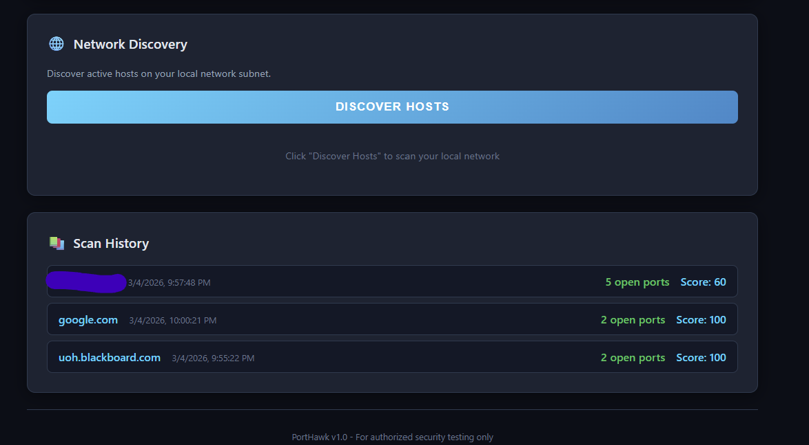

# PortHawk

<div align="center">


**Advanced Network Port Scanner, Vulnerability Detector & Security Assessment Tool**

A cybersecurity tool built with Node.js that scans network ports, detects running services, checks for known vulnerabilities, assesses security risk, and generates detailed reports — all through a clean web interface.

</div>

---

## Screenshots

<div align="center">




</div>

---

## Features

- **TCP Port Scanning** — Fast concurrent scanning with configurable timeout and parallelism
- **Service Detection** — Identifies running services (SSH, HTTP, FTP, MySQL, Redis, MongoDB, etc.)
- **Banner Grabbing** — Captures software versions and service banners from open ports
- **Vulnerability Detection** — Checks banners against a CVE database for known vulnerabilities
- **Security Score** — Generates a security grade (A–F) with a score out of 100
- **OS Detection** — Identifies the target operating system from service fingerprints
- **Network Discovery** — Discovers active hosts on your local network subnet
- **Risk Assessment** — Rates each open port: Critical / High / Medium / Low
- **Security Recommendations** — Actionable advice for each detected issue
- **Real-time Progress** — Live scan updates via Server-Sent Events (SSE)
- **Export Reports** — Download reports as JSON, CSV, or full HTML
- **Scan History** — Automatically saves every scan result for later review
- **Dark Cyber UI** — Professional dark-themed web interface

---

## Tech Stack

| Component | Technology |
|-----------|------------|
| Backend | Node.js, Express.js |
| Frontend | HTML5, CSS3, Vanilla JavaScript |
| Real-time | Server-Sent Events (SSE) |
| Scanning | Native `net` module (TCP Connect) |

---

## Project Structure

```
PortHawk/
├── server.js                  # Express API server
├── package.json
├── scanner/
│   ├── portScanner.js         # Port scanning engine with concurrency
│   ├── serviceDetector.js     # Service detection & risk assessment
│   ├── vulnChecker.js         # CVE vulnerability checker
│   └── networkDiscovery.js    # Local network host discovery
├── public/
│   ├── index.html             # Web interface
│   ├── style.css              # Dark cyber theme
│   └── script.js              # Frontend logic & SSE client
└── results/                   # Auto-created, stores saved scan JSON files
```

---

## Installation

```bash
git clone https://github.com/JumanALH/PortHawk.git
cd PortHawk
npm install
```

## Usage

```bash
npm start
Open http://localhost:3000
```

### Scan Options

| Option | Description |
|--------|-------------|
| **Common Ports** | 30 most common service ports |
| **Quick Scan** | 13 essential ports — fastest option |
| **Top 100** | Top 100 most used ports |
| **Full Range** | All ports 1–1024 |
| **Custom** | Define your own range (e.g. `80,443,8080` or `1-500`) |

---

## API Endpoints

| Method | Endpoint | Description |
|--------|----------|-------------|
| `POST` | `/api/scan` | Start a new port scan |
| `GET` | `/api/scan/:id/stream` | SSE stream for real-time progress |
| `GET` | `/api/scan/:id` | Get scan status and results |
| `GET` | `/api/scan/:id/export/json` | Export results as JSON |
| `GET` | `/api/scan/:id/export/csv` | Export results as CSV |
| `GET` | `/api/scan/:id/export/html` | Export full HTML security report |
| `POST` | `/api/scan/:id/save` | Save results to disk |
| `GET` | `/api/results` | List all saved scans |
| `GET` | `/api/network/local` | Get local network interfaces |
| `POST` | `/api/discover` | Discover active hosts on subnet |

---

## Vulnerability Detection

PortHawk checks service banners against a built-in CVE database:

| Service | CVEs Checked |
|---------|-------------|
| SSH | CVE-2016-0777, CVE-2018-15473, CVE-2021-41617 |
| HTTP | CVE-2021-44790 (Apache), CVE-2021-23017 (nginx), CVE-2017-7269 (IIS) |
| FTP | CVE-2011-2523 (vsftpd backdoor), CVE-2019-12815 (ProFTPD) |
| SMTP | CVE-2019-10149 (Exim RCE) |
| MySQL | CVE-2012-2122 (Auth bypass) |
| Redis | CVE-2022-0543 (Lua sandbox escape) |
| SMB | CVE-2017-0144 (EternalBlue / WannaCry) |
| RDP | CVE-2019-0708 (BlueKeep) |

---

## Security Score

| Grade | Score | Meaning |
|-------|-------|---------|
| **A** | 90–100 | Excellent — minimal exposure |
| **B** | 75–89 | Good — low risk |
| **C** | 60–74 | Fair — some concerns |
| **D** | 40–59 | Poor — significant risks |
| **F** | 0–39 | Critical — immediate action needed |

---

## Disclaimer

> **For authorized security testing and educational purposes only.**
> Unauthorized port scanning may be illegal in your jurisdiction. Always obtain proper permission before scanning any system you do not own.

## License

MIT License
